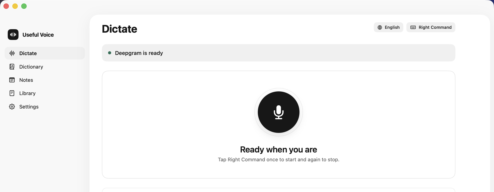
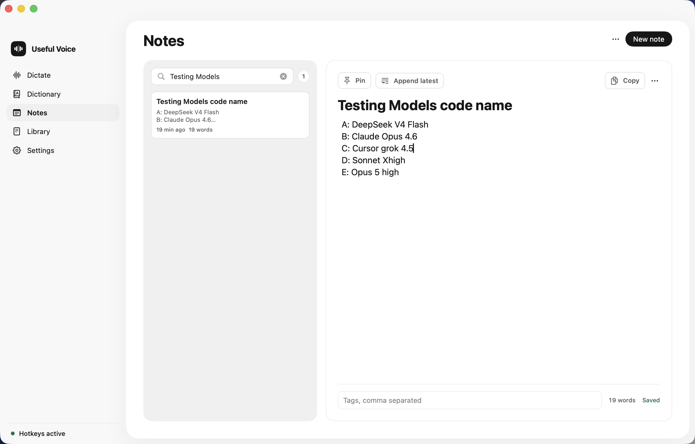
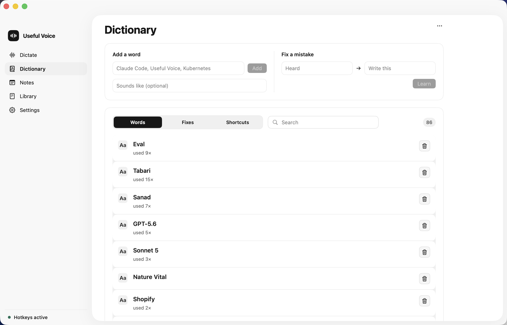
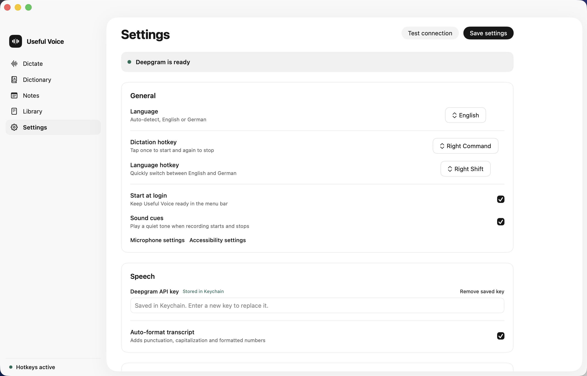

# Useful Voice

**Type with your voice, anywhere on your Mac.**

[](./LICENSE)
[](https://swift.org)


A fast, personal voice-dictation app for macOS and Windows. Tap a hotkey anywhere, speak in English or German, and the transcript lands at your cursor. Powered by Deepgram Nova-3 for fast, accurate speech-to-text.

Useful Voice records, transcribes, applies your personal dictionary and inserts the result at your cursor with a clipboard backup. The main window focuses on five clear areas: Dictate, Library, Dictionary, Notes and Settings.









## Build and run

```bash
make bundle      # builds dist/UsefulVoice.app (ad-hoc signed)
open dist/UsefulVoice.app
```

A waveform icon appears in the menu bar. No Dock icon.

Requirements: macOS 14+, Apple Silicon, Command Line Tools (no full Xcode needed).

## First-run setup (do this once)

1. **Microphone**: grant it when macOS prompts (or System Settings > Privacy & Security > Microphone).
2. **Accessibility**: System Settings > Privacy & Security > Accessibility, enable Useful Voice. This powers the tap hotkeys AND inserting text at your cursor. The app polls for this, so once you grant it the hotkey starts working without a relaunch (no need to quit and reopen).
3. **Deepgram API key**: open Settings and paste your Deepgram API key. Useful Voice transcribes with the Deepgram Nova-3 model. Turn **Auto-format transcript** on for punctuation, capitalization and formatted numbers, or off for raw text.

Your Deepgram API key is stored in the macOS Keychain, never in a file.

Until your key is configured, every dictation ends with the HUD saying "No transcription provider configured."
Use **Test connection** in Settings to run a tiny redacted transcription probe before you rely on it.

## Using it

- **Tap your dictation key** to start recording (Right Command by default; an ink pill appears at the bottom of the screen). Tap again to stop, transcribe and insert.
- **Esc** while recording cancels.
- Recording auto-stops after 60s of silence or 10 minutes total.
- Pick **Auto-detect / English / German** in the menu bar.
- The final text is always copied to the clipboard as a backup, so if insertion misses you can paste it.
- Teach Useful Voice exact names and specialist spellings in **Dictionary**. Words bias Deepgram recognition *and* fix casing locally. Add a "sounds like" form so misheard variants are rewritten after STT.
- **Learn once, fix forever**: use **Fix a recurring mistake** on the Dictionary page, or **Teach the dictionary** in Library. Useful Voice stores a deterministic auto-correction and a high-priority dictionary term, so the same error is corrected on the next dictation.
- Learning uses an OpenWhispr-style correction learner (word-level LCS + edit distance) so multi-word edits can teach several pairs at once.
- Use **Notes** for local dictated notes with search, pins, auto-save, tags, Markdown copy, JSON backup/restore and append-latest-dictation.
- In **Library**, search, copy, send a dictation to Notes, reprocess retained audio or teach a correction into the dictionary.

## Transcription model

Useful Voice uses Deepgram's **Nova-3** model for all dictation. Auto-format (Deepgram's `smart_format`) adds punctuation, capitalization and formatted numbers and dates; turn it off in Settings for raw text. Your personal dictionary terms (correct spellings only) are sent as Deepgram keyterms to bias recognition. Misheard forms, aliases and auto-corrections always run locally after transcription so learning actually sticks. Local app data stays under the app's Application Support directory; Useful Voice does not read, scan, index, or default-save into your Documents folder.

## Develop

```bash
make test        # Swift Testing suite
swift build      # debug build
```

Tests run under Command Line Tools; the Makefile injects the framework paths Swift Testing needs. Use `make test`, not bare `swift test`.

## Windows

The Windows app lives in [`windows/`](windows/README.md) — Electron + TypeScript,
sharing this design system, the dictionary and language-memory model, and the
Deepgram request shape, so a backup taken on one platform is readable by the other.

```bash
cd windows
npm install
npm run verify      # typecheck + 258 tests + build + headless self-test
npm start
npm run dist        # NSIS installer + portable exe -> windows/release/
```

Its platform-free core is deliberately separated from the Electron shell, so the
whole logic suite runs on any OS. Read
[`windows/README.md`](windows/README.md) first: it states plainly which parts are
verified by execution and which still require a Windows machine to confirm.

## Security and data handling

- The Deepgram API key is stored in the macOS Keychain, and on Windows encrypted
  with DPAPI. It is never written to a plain file, and the renderer can only ask
  *whether* a key is configured, never read it.
- A keychain that cannot be read is reported as exactly that. "Your keychain is
  locked" and "you have not set a key" are different problems with different fixes,
  so the app never tells you to re-enter a key that is already stored and fine.
- **Your data is owner-only.** The data directory, the recordings, and the
  transcript files are `0700`/`0600` — not the `0755`/`0644` the process umask
  would otherwise produce, which would make your dictionary and recorded speech
  readable by every other account on the machine. This is re-applied at launch, so
  files written by an earlier build, or restored from a backup, are corrected too.
- Audio is held in memory only while transcribing and is never written to disk
  except as retained recordings, which are deleted as newer ones replace them.
  Only the resulting text is sent to Deepgram.
- The Windows renderer runs with `contextIsolation` on, `nodeIntegration` off, and a
  strict `file://` CSP; 50 named IPC channels are its entire surface.
- A store that cannot read its file **refuses to write** rather than starting empty,
  so a transient read error can never erase your dictionary, notes or history.
- **Diagnostics never record what you said.** The log in Settings holds failure
  descriptions only — no transcript text, no API key. Its API accepts only
  category/message pairs, so there is no method through which a transcript could be
  recorded by accident.

## Robustness

- The keyterm list sent to Deepgram is capped at 400 tokens (Nova-3 hard-fails above
  500 across all keyterms, which would break every dictation at once).
- A silent recording is rejected rather than transcribed, because a speech model can
  echo its own prompt bias — your dictionary — back as a fake transcript.
- Delivery is raced against a timeout, so a lost callback can never wedge the app in
  a state where the hotkey does nothing.
- After a dictation the text is either pasted or left on the clipboard, never
  neither; the previous clipboard is restored only once the paste has been shown to
  have landed.
- Failures are recorded to a bounded log and shown in **Settings › Diagnostics**,
  with a Copy report button. Before this, every error lived for a few seconds in a
  floating pill and was gone, which made an intermittent fault impossible to
  diagnose.
- The one-time import of a legacy `dictionary.json` verifies that its result reached
  disk. If it did not, the original files are left untouched and the failure is
  recorded, rather than the app proceeding with an empty dictionary.

## Audits

Four detailed reports in [`docs/audit/`](docs/audit) cover the recording pipeline,
hotkey and lifecycle, the dictionary and language memory, and the UI. Start with
[`00-findings-and-fixes.md`](docs/audit/00-findings-and-fixes.md), which summarises
every finding, what changed, how each change is verified, and what was deliberately
left alone.

## Layout

- `Sources/UsefulVoiceCore` - testable core: settings, keychain, providers, audio writer/recorder, recording store, hotkey recognizer, Language Memory, Scratchpad, history, and the `DictationController` pipeline.
- `Sources/UsefulVoiceApp` - macOS glue: AppDelegate, menu bar, HUD, hotkey tap, text insertion, premium pages, and settings window.
- `windows/` - the Windows port: `src/core` (platform-free TypeScript), `src/main` (Electron main), `src/preload`, `src/renderer`, and its vitest suites.
- `docs/superpowers/specs` - the design spec. `docs/superpowers/plans` - the implementation plan.
- `assets/branding` - the app icon: `useful-voice-mark-dark.svg` and the generated `.icns`.

## License

MIT. See [LICENSE](LICENSE).
